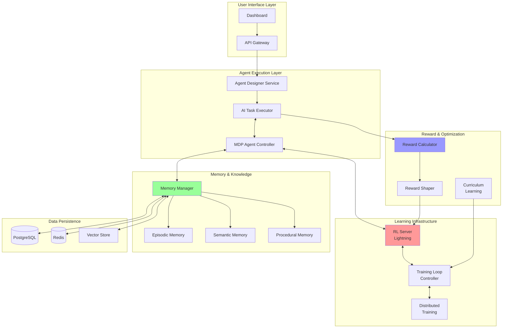

# Solution Architecture: RL & Learning Integration (SA-007)

## Executive Summary

This architecture integrates advanced Reinforcement Learning (RL), memory systems, and continuous learning capabilities into the existing AI Agent Framework. The solution transforms the current static AI execution model into a dynamic, self-improving system where agents learn from experience, maintain long-term memory, and optimize their performance through reinforcement signals.

## Current State Analysis

### Existing Components
- **Operational**: Basic AI task execution with Claude/OpenAI
- **Operational**: PostgreSQL persistence for tasks and agent state
- **Operational**: Redis caching and pub/sub events
- **Not Integrated**: RL training infrastructure (lightning_server_rl.py)
- **Not Integrated**: MDP agent models (mdp_agents.py)
- **Not Integrated**: Memory management system (memory_manager.py)
- **Not Integrated**: Distributed training (distributed_training.py)
- **Not Integrated**: Reward functions (reward_functions.py)

## Proposed Architecture

### High-Level Design



### Component Integration Map

```yaml
integration_phases:
  phase_1_foundation:
    - component: RL Server Integration
      services:
        - lightning_server_rl.py
        - agentlightning framework
      integration_points:
        - Agent Designer Service
        - API Gateway
      
  phase_2_memory:
    - component: Memory System
      services:
        - memory_manager.py
        - shared_memory_system.py
      integration_points:
        - AI Task Executor
        - MDP Agents
        
  phase_3_learning:
    - component: Training Infrastructure
      services:
        - distributed_training.py
        - curriculum_learning.py
      integration_points:
        - RL Server
        - Training Loop Controller
        
  phase_4_optimization:
    - component: Reward System
      services:
        - reward_functions.py
        - meta_learning.py
      integration_points:
        - Task Completion Events
        - Agent Performance Metrics
```

## Detailed Component Design

### 1. MDP Agent Controller

```python
class MDPAgentController:
    """
    Bridge between current AI Task Executor and MDP/RL agents
    """
    
    def __init__(self):
        self.mdp_agents = {}  # agent_id -> MDPAgent
        self.rl_client = LightningClient()  # Connection to RL server
        self.memory_manager = MemoryManager()
        self.reward_calculator = RewardCalculator()
        
    async def execute_with_learning(self, task_id: str, agent_id: str):
        # 1. Get or create MDP agent
        mdp_agent = self.get_or_create_mdp_agent(agent_id)
        
        # 2. Create state from task context
        state = mdp_agent.observe(task_context)
        
        # 3. Retrieve relevant memories
        memories = self.memory_manager.retrieve_relevant(state)
        
        # 4. Generate action (with exploration)
        action = await mdp_agent.act(state, memories)
        
        # 5. Execute action
        result = await self.execute_action(action)
        
        # 6. Calculate reward
        reward = self.reward_calculator.calculate(result)
        
        # 7. Store transition for learning
        transition = MDPTransition(state, action, reward, next_state)
        self.rl_client.store_transition(transition)
        
        # 8. Update memory
        self.memory_manager.store_episodic(transition)
        
        # 9. Trigger learning if batch ready
        if self.should_trigger_learning():
            await self.rl_client.train_step()
        
        return result
```

### 2. Integrated Memory Architecture

```python
class IntegratedMemorySystem:
    """
    Unified memory system across all agents
    """
    
    def __init__(self):
        # Memory stores with PostgreSQL backing
        self.episodic = EpisodicMemoryStore(pg_connection)
        self.semantic = SemanticMemoryStore(pg_connection)
        self.procedural = ProceduralMemoryStore(pg_connection)
        
        # Vector embeddings for similarity search
        self.vector_store = VectorStore(redis_connection)
        
        # Memory consolidation process
        self.consolidator = MemoryConsolidator()
        
    async def store_experience(self, agent_id: str, experience: Dict):
        # Store in episodic memory
        episodic_id = await self.episodic.store(agent_id, experience)
        
        # Generate embedding
        embedding = self.generate_embedding(experience)
        await self.vector_store.index(episodic_id, embedding)
        
        # Check for consolidation opportunities
        if self.should_consolidate():
            await self.consolidator.consolidate_to_semantic()
            
    async def retrieve_for_task(self, task_context: Dict, k: int = 10):
        # Multi-level retrieval
        recent = await self.episodic.get_recent(k//3)
        similar = await self.vector_store.search_similar(task_context, k//3)
        relevant = await self.semantic.get_relevant(task_context, k//3)
        
        return self.merge_and_rank(recent, similar, relevant)
```

### 3. Training Loop Integration

```python
class TrainingLoopController:
    """
    Manages continuous learning cycles
    """
    
    def __init__(self):
        self.rl_server = LightningServer()
        self.distributed_trainer = DistributedTrainer()
        self.curriculum_manager = CurriculumManager()
        
    async def training_loop(self):
        while True:
            # 1. Collect experiences from all agents
            experiences = await self.collect_experiences()
            
            # 2. Prepare training batch
            batch = self.prepare_batch(experiences)
            
            # 3. Adjust curriculum difficulty
            difficulty = self.curriculum_manager.get_current_difficulty()
            
            # 4. Distributed training step
            metrics = await self.distributed_trainer.train_step(
                batch, 
                difficulty
            )
            
            # 5. Update agent policies
            await self.update_agent_policies(metrics)
            
            # 6. Checkpoint if needed
            if self.should_checkpoint():
                await self.save_checkpoint()
            
            # Sleep before next iteration
            await asyncio.sleep(TRAINING_INTERVAL)
```

### 4. Reward Signal Integration

```python
class RewardSignalIntegrator:
    """
    Captures and processes reward signals from task completions
    """
    
    def __init__(self):
        self.reward_calculator = RewardCalculator()
        self.reward_shaper = RewardShaper()
        self.credit_assigner = CreditAssigner()
        
    async def process_task_completion(self, task_id: str, result: Dict):
        # 1. Calculate raw reward
        raw_reward = self.reward_calculator.calculate(
            task_type=result['task_type'],
            output=result['output'],
            ground_truth=result.get('expected'),
            metadata=result['metadata']
        )
        
        # 2. Shape reward for better learning
        shaped_reward = self.reward_shaper.shape(
            raw_reward,
            intermediate_steps=result.get('steps', [])
        )
        
        # 3. Assign credit to contributing agents
        agent_credits = self.credit_assigner.assign(
            shaped_reward,
            participating_agents=result['agents']
        )
        
        # 4. Store rewards for training
        for agent_id, credit in agent_credits.items():
            await self.store_reward_signal(agent_id, credit)
```

## Database Schema Updates

```sql
-- Memory tables
CREATE TABLE agent_memories (
    id UUID PRIMARY KEY,
    agent_id VARCHAR(50) NOT NULL,
    memory_type VARCHAR(20) NOT NULL, -- 'episodic', 'semantic', 'procedural'
    content JSONB NOT NULL,
    embedding VECTOR(768),
    importance FLOAT DEFAULT 0.5,
    access_count INTEGER DEFAULT 0,
    last_accessed TIMESTAMP,
    created_at TIMESTAMP DEFAULT CURRENT_TIMESTAMP,
    FOREIGN KEY (agent_id) REFERENCES agents(id)
);

-- Training data
CREATE TABLE training_transitions (
    id UUID PRIMARY KEY,
    agent_id VARCHAR(50) NOT NULL,
    state JSONB NOT NULL,
    action JSONB NOT NULL,
    reward FLOAT NOT NULL,
    next_state JSONB NOT NULL,
    done BOOLEAN DEFAULT FALSE,
    created_at TIMESTAMP DEFAULT CURRENT_TIMESTAMP,
    batch_id UUID,
    FOREIGN KEY (agent_id) REFERENCES agents(id)
);

-- Reward history
CREATE TABLE reward_history (
    id UUID PRIMARY KEY,
    task_id UUID NOT NULL,
    agent_id VARCHAR(50) NOT NULL,
    raw_reward FLOAT NOT NULL,
    shaped_reward FLOAT NOT NULL,
    credit_assigned FLOAT NOT NULL,
    metadata JSONB,
    created_at TIMESTAMP DEFAULT CURRENT_TIMESTAMP,
    FOREIGN KEY (task_id) REFERENCES tasks(id),
    FOREIGN KEY (agent_id) REFERENCES agents(id)
);

-- Model checkpoints
CREATE TABLE model_checkpoints (
    id UUID PRIMARY KEY,
    agent_id VARCHAR(50) NOT NULL,
    checkpoint_path VARCHAR(500) NOT NULL,
    performance_metrics JSONB NOT NULL,
    training_iteration INTEGER NOT NULL,
    created_at TIMESTAMP DEFAULT CURRENT_TIMESTAMP,
    FOREIGN KEY (agent_id) REFERENCES agents(id)
);

-- Create indexes for performance
CREATE INDEX idx_memories_agent_type ON agent_memories(agent_id, memory_type);
CREATE INDEX idx_memories_embedding ON agent_memories USING ivfflat (embedding vector_cosine_ops);
CREATE INDEX idx_transitions_batch ON training_transitions(batch_id);
CREATE INDEX idx_rewards_task_agent ON reward_history(task_id, agent_id);
```

## API Endpoints

### New Endpoints for RL/Learning

```yaml
/api/v1/training:
  /start:
    POST: Start training loop
    params:
      - batch_size: int
      - learning_rate: float
      - num_epochs: int
      
  /stop:
    POST: Stop training loop
    
  /status:
    GET: Get training status and metrics
    
/api/v1/memory:
  /store:
    POST: Store memory entry
    body:
      - agent_id: string
      - memory_type: string
      - content: object
      
  /retrieve:
    POST: Retrieve relevant memories
    body:
      - context: object
      - k: int
      - memory_types: array
      
  /consolidate:
    POST: Trigger memory consolidation
    
/api/v1/rewards:
  /calculate:
    POST: Calculate reward for task
    body:
      - task_id: string
      - result: object
      
  /history:
    GET: Get reward history
    params:
      - agent_id: string
      - limit: int
```

## Implementation Phases

### Phase 1: Foundation (Week 1)
1. Set up Lightning RL Server
2. Create MDP Agent Controller
3. Integrate with Agent Designer Service
4. Basic reward calculation

### Phase 2: Memory System (Week 2)
1. Implement Memory Manager integration
2. Set up vector store for embeddings
3. Create memory persistence layer
4. Implement retrieval mechanisms

### Phase 3: Training Infrastructure (Week 3)
1. Set up distributed training
2. Implement training loop controller
3. Create curriculum learning manager
4. Integrate with existing services

### Phase 4: Optimization (Week 4)
1. Implement reward shaping
2. Set up credit assignment
3. Create meta-learning capabilities
4. Performance optimization

## Performance Metrics

```yaml
learning_metrics:
  - average_reward: Track reward trends
  - task_success_rate: Completion percentage
  - learning_efficiency: Samples to convergence
  - memory_utilization: Retrieval effectiveness
  
system_metrics:
  - training_throughput: Samples/second
  - memory_latency: Retrieval time
  - model_convergence: Loss curves
  - resource_utilization: CPU/GPU/Memory
```

## Risk Mitigation

| Risk | Impact | Mitigation |
|------|--------|------------|
| Training instability | High | Implement gradient clipping, learning rate scheduling |
| Memory overflow | Medium | Set retention policies, implement forgetting mechanisms |
| Reward hacking | High | Use reward shaping, add safety constraints |
| Performance degradation | Medium | Maintain baseline models, A/B testing |
| Data corruption | High | Regular checkpoints, validation checks |

## Success Criteria

1. **Learning Effectiveness**
   - 30% improvement in task success rate after 1000 training iterations
   - Reduced task completion time by 20%
   
2. **Memory Utilization**
   - 90% relevant memory retrieval accuracy
   - < 100ms retrieval latency
   
3. **System Performance**
   - Support 100+ concurrent learning agents
   - < 5% overhead on task execution
   
4. **Continuous Improvement**
   - Measurable performance gains week-over-week
   - Successful transfer learning across task types

## Conclusion

This architecture transforms the AI Agent Framework from a static execution system to a dynamic, learning-enabled platform. By integrating RL, memory, and continuous training, agents will improve their performance over time, learn from experience, and adapt to new challenges automatically.

The phased implementation approach ensures stability while progressively adding advanced capabilities. The system will maintain backward compatibility while enabling cutting-edge learning features for enterprise AI applications.