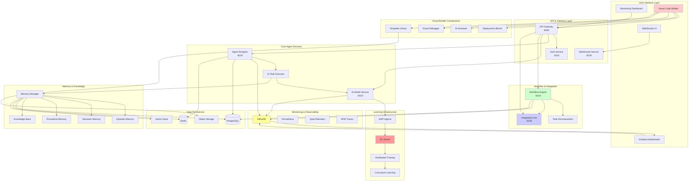

# Complete System Integration Architecture (SA-008)

## Executive Summary

This comprehensive architecture integrates ALL components of the Agent Lightning ecosystem, including the previously overlooked Visual Code Builder, Workflow Engine, Integration Hub, Monitoring Infrastructure (InfluxDB/Grafana), and WebSocket real-time communication alongside the RL/Learning capabilities.

## Complete Component Inventory

### Currently Operational
1. **Core Services**
   - Agent Designer Service (port 8002/8102)
   - AI Model Service (port 8003/8103) 
   - Auth Service (port 8001/8101)
   - API Gateway (port 8000)
   - WebSocket Service (port 8009/8109)

2. **Data Layer**
   - PostgreSQL Database
   - Redis Cache & Pub/Sub
   - Shared Data Access Layer

3. **AI Integration**
   - AI Task Executor (Claude/OpenAI)
   - Real-time task processing

### Not Yet Integrated
1. **Visual Code Builder**
   - visual_deployment_blocks.py
   - visual_ai_assistant.py
   - visual_debugger.py
   - visual_templates_library.py

2. **Workflow Engine**
   - workflow_engine_service_integrated.py
   - Orchestration workflows
   - Task decomposition

3. **Integration Hub**
   - integration_hub_service_integrated.py
   - External API connections
   - Service mesh coordination

4. **Monitoring & Observability**
   - InfluxDB metrics storage
   - Grafana dashboards
   - Performance monitoring
   - Distributed tracing

5. **RL & Learning Systems**
   - Lightning RL Server
   - MDP Agents
   - Memory Manager
   - Distributed Training

## Complete System Architecture



## Missing Component Integration Plan

### 1. Visual Code Builder Integration

```python
class VisualCodeBuilderIntegration:
    """
    Integrates visual programming interface with agent execution
    """
    
    def __init__(self):
        self.deployment_blocks = VisualDeploymentBlocks()
        self.ai_assistant = VisualAIAssistant()
        self.debugger = VisualDebugger()
        self.templates = VisualTemplatesLibrary()
        
    async def visual_to_agent_task(self, visual_flow: Dict):
        """Convert visual flow to agent tasks"""
        # 1. Parse visual blocks
        blocks = self.parse_visual_blocks(visual_flow)
        
        # 2. Generate code from blocks
        code = self.deployment_blocks.generate_code(blocks)
        
        # 3. Create agent tasks
        tasks = []
        for block in blocks:
            task = {
                'type': block['type'],
                'code': block['generated_code'],
                'dependencies': block['connections'],
                'agent_type': self.select_agent_for_block(block)
            }
            tasks.append(task)
        
        # 4. Submit to workflow engine
        workflow_id = await self.submit_to_workflow(tasks)
        
        return workflow_id
```

### 2. Workflow Engine Integration

```python
class WorkflowEngineIntegration:
    """
    Orchestrates complex multi-agent workflows
    """
    
    def __init__(self):
        self.workflow_service = WorkflowEngineService()
        self.task_decomposer = TaskDecomposition()
        self.orchestrator = OrchestrationWorkflows()
        
    async def execute_workflow(self, workflow_def: Dict):
        """Execute complex workflow with task decomposition"""
        # 1. Decompose into subtasks
        subtasks = self.task_decomposer.decompose(workflow_def)
        
        # 2. Create execution plan
        plan = self.orchestrator.create_plan(subtasks)
        
        # 3. Assign agents
        for task in plan['tasks']:
            agent = await self.select_optimal_agent(task)
            task['assigned_agent'] = agent
        
        # 4. Execute with monitoring
        execution_id = await self.workflow_service.execute(plan)
        
        # 5. Track progress
        await self.monitor_execution(execution_id)
        
        return execution_id
```

### 3. Integration Hub Enhancement

```python
class IntegrationHubEnhancement:
    """
    Central hub for all external integrations
    """
    
    def __init__(self):
        self.connectors = {
            'github': GitHubConnector(),
            'slack': SlackConnector(),
            'jira': JiraConnector(),
            'aws': AWSConnector(),
            'gcp': GCPConnector(),
            'azure': AzureConnector()
        }
        
    async def handle_external_event(self, source: str, event: Dict):
        """Process external events and trigger workflows"""
        connector = self.connectors.get(source)
        if not connector:
            raise ValueError(f"Unknown source: {source}")
        
        # Process event
        processed = await connector.process_event(event)
        
        # Trigger appropriate workflow
        if processed['requires_action']:
            workflow = self.map_event_to_workflow(processed)
            await self.trigger_workflow(workflow)
```

### 4. Complete Monitoring Stack

```python
class MonitoringStackIntegration:
    """
    Comprehensive monitoring and observability
    """
    
    def __init__(self):
        self.influx = InfluxDBClient()
        self.grafana = GrafanaAPI()
        self.opentelemetry = OpenTelemetryExporter()
        
    async def setup_complete_monitoring(self):
        """Setup all monitoring components"""
        # 1. Create InfluxDB buckets
        await self.influx.create_bucket("agent_metrics")
        await self.influx.create_bucket("training_metrics")
        await self.influx.create_bucket("system_metrics")
        
        # 2. Setup Grafana dashboards
        dashboards = [
            self.create_agent_performance_dashboard(),
            self.create_training_progress_dashboard(),
            self.create_system_health_dashboard(),
            self.create_workflow_execution_dashboard()
        ]
        
        for dashboard in dashboards:
            await self.grafana.create_dashboard(dashboard)
        
        # 3. Configure OpenTelemetry
        self.opentelemetry.configure_traces()
        self.opentelemetry.configure_metrics()
        self.opentelemetry.configure_logs()
```

## Updated Database Schema

```sql
-- Visual Code Builder tables
CREATE TABLE visual_flows (
    id UUID PRIMARY KEY,
    name VARCHAR(255) NOT NULL,
    flow_definition JSONB NOT NULL,
    generated_code TEXT,
    created_by VARCHAR(50),
    created_at TIMESTAMP DEFAULT CURRENT_TIMESTAMP,
    updated_at TIMESTAMP DEFAULT CURRENT_TIMESTAMP
);

CREATE TABLE visual_blocks (
    id UUID PRIMARY KEY,
    flow_id UUID REFERENCES visual_flows(id),
    block_type VARCHAR(50) NOT NULL,
    configuration JSONB NOT NULL,
    position JSONB NOT NULL,
    connections JSONB
);

-- Workflow Engine tables
CREATE TABLE workflows (
    id UUID PRIMARY KEY,
    name VARCHAR(255) NOT NULL,
    definition JSONB NOT NULL,
    status VARCHAR(50) DEFAULT 'created',
    created_at TIMESTAMP DEFAULT CURRENT_TIMESTAMP,
    started_at TIMESTAMP,
    completed_at TIMESTAMP
);

CREATE TABLE workflow_tasks (
    id UUID PRIMARY KEY,
    workflow_id UUID REFERENCES workflows(id),
    task_type VARCHAR(50) NOT NULL,
    configuration JSONB NOT NULL,
    status VARCHAR(50) DEFAULT 'pending',
    assigned_agent VARCHAR(50),
    result JSONB,
    created_at TIMESTAMP DEFAULT CURRENT_TIMESTAMP,
    started_at TIMESTAMP,
    completed_at TIMESTAMP
);

-- Integration Hub tables
CREATE TABLE external_connections (
    id UUID PRIMARY KEY,
    service_name VARCHAR(50) NOT NULL,
    configuration JSONB NOT NULL,
    credentials_encrypted TEXT,
    status VARCHAR(50) DEFAULT 'active',
    last_sync TIMESTAMP,
    created_at TIMESTAMP DEFAULT CURRENT_TIMESTAMP
);

CREATE TABLE integration_events (
    id UUID PRIMARY KEY,
    connection_id UUID REFERENCES external_connections(id),
    event_type VARCHAR(50) NOT NULL,
    payload JSONB NOT NULL,
    processed BOOLEAN DEFAULT FALSE,
    workflow_triggered UUID,
    created_at TIMESTAMP DEFAULT CURRENT_TIMESTAMP
);

-- Monitoring tables
CREATE TABLE metric_definitions (
    id UUID PRIMARY KEY,
    name VARCHAR(255) NOT NULL,
    type VARCHAR(50) NOT NULL,
    unit VARCHAR(50),
    description TEXT,
    dashboard_id UUID,
    created_at TIMESTAMP DEFAULT CURRENT_TIMESTAMP
);

CREATE TABLE alert_rules (
    id UUID PRIMARY KEY,
    metric_id UUID REFERENCES metric_definitions(id),
    condition JSONB NOT NULL,
    severity VARCHAR(20),
    notification_channels JSONB,
    active BOOLEAN DEFAULT TRUE,
    created_at TIMESTAMP DEFAULT CURRENT_TIMESTAMP
);
```

## Service Port Allocation

| Service | Development Port | Production Port | Status |
|---------|-----------------|-----------------|--------|
| API Gateway | 8000 | 8000 | ✅ Running |
| Auth Service | 8001 | 8101 | ✅ Running |
| Agent Designer | 8002 | 8102 | ✅ Running |
| AI Model Service | 8003 | 8103 | ✅ Running |
| Workflow Engine | 8004 | 8104 | ❌ Not Running |
| Integration Hub | 8005 | 8105 | ❌ Not Running |
| Visual Builder API | 8006 | 8106 | ❌ Not Running |
| RL Server | 8007 | 8107 | ❌ Not Running |
| Monitoring API | 8008 | 8108 | ❌ Not Running |
| WebSocket Service | 8009 | 8109 | ✅ Running |
| InfluxDB | 8086 | 8086 | ❌ Not Running |
| Grafana | 3000 | 3000 | ❌ Not Running |

## Complete Implementation Roadmap

### Phase 1: Foundation Services (Week 1)
- [ ] Start Workflow Engine Service
- [ ] Start Integration Hub Service
- [ ] Connect to existing Agent Designer
- [ ] Setup service discovery

### Phase 2: Visual Builder (Week 2)
- [ ] Integrate Visual Code Builder
- [ ] Connect visual blocks to workflow engine
- [ ] Implement visual debugging
- [ ] Setup template library

### Phase 3: Monitoring Stack (Week 3)
- [ ] Start InfluxDB
- [ ] Configure Grafana dashboards
- [ ] Setup metric collection
- [ ] Implement alerting

### Phase 4: RL & Learning (Week 4)
- [ ] Start Lightning RL Server
- [ ] Connect MDP agents
- [ ] Setup training pipeline
- [ ] Implement memory system

### Phase 5: Integration & Testing (Week 5)
- [ ] End-to-end testing
- [ ] Performance optimization
- [ ] Documentation
- [ ] Production deployment

## Critical Integration Points

1. **Visual Builder → Workflow Engine**
   - Visual flows generate workflows
   - Real-time preview and debugging

2. **Workflow Engine → Agent Designer**
   - Dynamic agent assignment
   - Task distribution

3. **Agent Designer → RL Server**
   - Learning from execution
   - Policy updates

4. **All Services → Monitoring**
   - Metrics collection
   - Performance tracking
   - Error reporting

5. **Integration Hub → External Systems**
   - Webhook handling
   - API synchronization
   - Event processing

## Success Metrics

- **System Completeness**: 100% of components integrated
- **Visual Programming**: < 5 min from visual design to execution
- **Workflow Efficiency**: 50% reduction in task completion time
- **Learning Effectiveness**: 30% improvement after 1000 iterations
- **Monitoring Coverage**: 100% observability of all services
- **Integration Reliability**: 99.9% uptime for external connections

## Risk Mitigation

| Component | Risk | Mitigation |
|-----------|------|------------|
| Visual Builder | Complexity overwhelming users | Progressive disclosure UI |
| Workflow Engine | Deadlocks in complex flows | Timeout and recovery mechanisms |
| Integration Hub | External API failures | Circuit breakers and retries |
| RL Server | Training instability | Checkpointing and rollback |
| Monitoring | Data volume overwhelming | Retention policies and aggregation |

## Conclusion

This complete architecture integrates ALL components of your Agent Lightning ecosystem. The Visual Code Builder, Workflow Engine, Integration Hub, and Monitoring stack are critical components that must be integrated alongside the RL/Learning capabilities for a truly comprehensive, enterprise-ready AI agent platform.